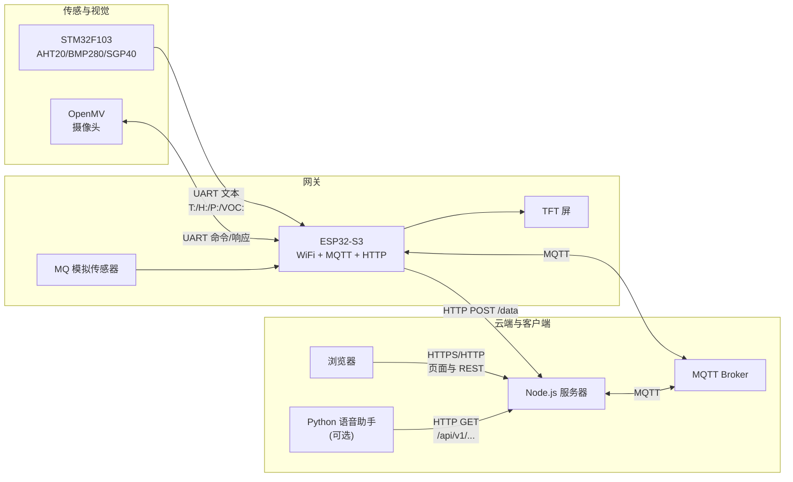
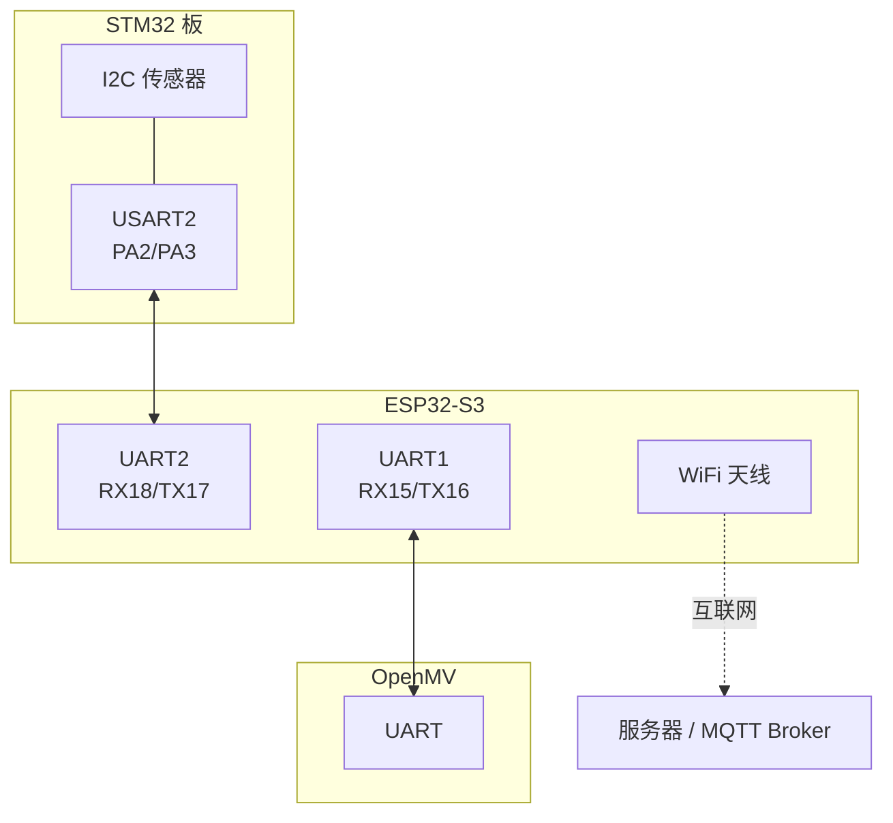
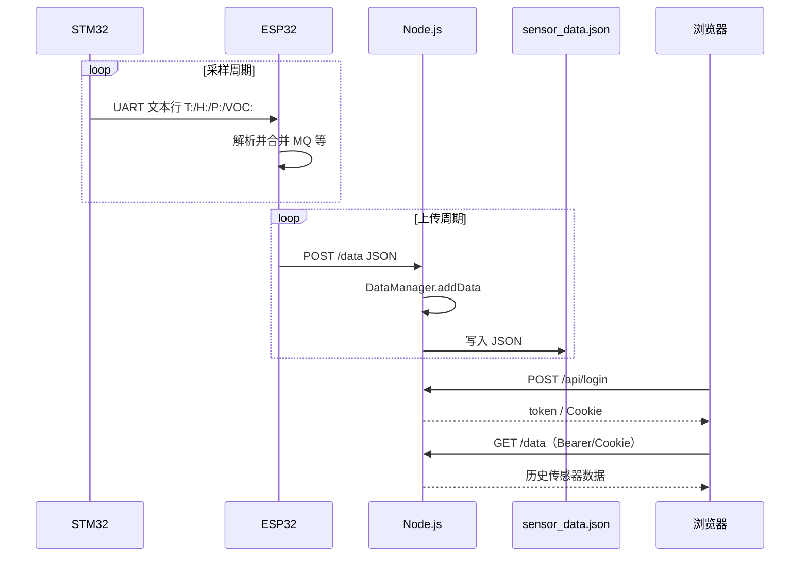
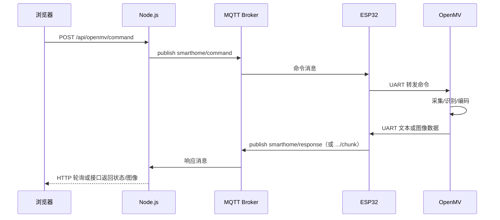
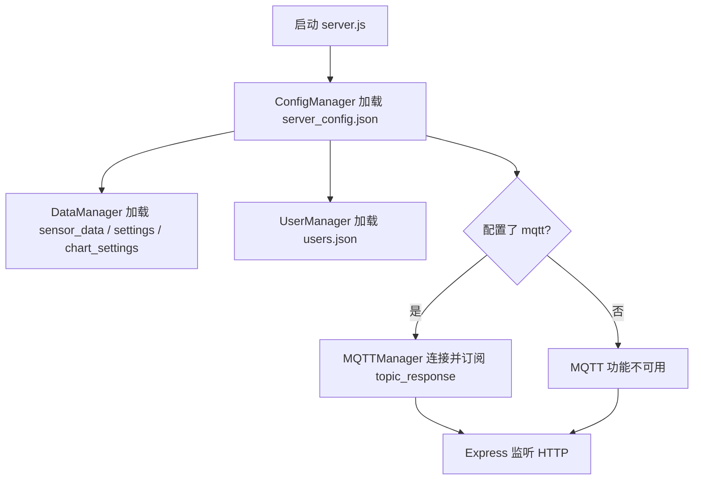

# 智能家居监控系统（SmartHome）

## 项目简介

本项目是一套**端到端智能家居环境监测与扩展能力**的开源方案：在边缘侧用 STM32 采集温湿度、气压与 VOC 等环境量，经 ESP32-S3 网关汇聚本地 MQ 传感器数据，通过 WiFi 以 HTTP 上报至 Node.js 服务端持久化；浏览器端提供仪表盘、图表与账户体系。系统可选接入 **OpenMV** 视觉模块，经 MQTT 与串口实现人脸采集、识别与图像回传；另提供基于云端大模型能力的 **Python 语音助手**，通过公开 HTTP 接口查询实时与历史传感器数据，实现语音问询环境状态。

**典型应用场景**：家庭或机房环境监控、简易安防与人脸管理演示、语音助手与物联网数据联动原型。**技术特点**：无重型数据库（JSON 文件存储）、多页 Web + REST、MQTT 异步桥接边缘设备与云端、固件与脚本可独立替换与扩展。

本文档说明**系统组成、硬件连接、数据通路与主要接口**。

---

## 技术栈与依赖

| 层级 | 技术 |
|------|------|
| 服务端 | Node.js **≥ 14**、Express、**mqtt**、**pnpm**（见 `server_node/package.json`） |
| Web 前端 | 多页 HTML/CSS/JS、**Chart.js**（CDN） |
| 网关固件 | **ESP32-S3**（`esp32-s3-devkitc-1`）、PlatformIO、TFT_eSPI、PubSubClient、EspSoftwareSerial |
| 采集固件 | **STM32F103C6**、AHT20 / BMP280 / SGP40（PlatformIO + Adafruit 等库） |
| 视觉 | **OpenMV** 自带 MicroPython API（`sensor`、`image`、`pyb` 等），无额外 pip 依赖 |
| 语音助手 | Python 3、**DashScope**、sounddevice、requests、PyJWT 等（见 `smarthomellm1/requirements.txt`） |

仓库**根目录无**统一 `LICENSE`、`Dockerfile`；各子目录可有独立 `.gitignore`。部署 MQTT 需自行准备 **MQTT Broker**（与 Node、ESP32 网络互通）。

---

## 目录

- [项目简介](#项目简介)
- [技术栈与依赖](#技术栈与依赖)
- [1. 系统总览](#1-系统总览)
- [2. 硬件架构](#2-硬件架构)
- [3. 数据通路概览](#3-数据通路概览)
- [4. 数据流详解](#4-数据流详解)
- [5. 流程图（Mermaid）](#5-流程图mermaid)
- [6. MQTT 主题与消息形态](#6-mqtt-主题与消息形态)
- [7. HTTP API 摘要](#7-http-api-摘要)
- [8. 子项目说明与运行方式](#8-子项目说明与运行方式)
- [9. 配置与安全](#9-配置与安全)
- [10. 仓库目录结构](#10-仓库目录结构)
- [11. 持久化文件与端口](#11-持久化文件与端口)
- [12. 故障排查](#12-故障排查)

---

## 1. 系统总览

| 组件 | 路径 | 作用 |
|------|------|------|
| 云端服务 | `server_node/` | Express：传感器入库、用户认证、静态 Web、MQTT 与 OpenMV 命令桥接 |
| ESP32 网关 | `smarthome_esp32/` | WiFi、HTTP 上报、`/data`、MQTT 收发、TFT、STM32/OpenMV 串口 |
| STM32 采集端 | `smarthome_stm32/` | AHT20 / BMP280 / SGP40，经 UART 文本协议发给 ESP32 |
| OpenMV | `openmv/` | 人脸采集/识别等，经 UART 与 ESP32 对接 |
| 语音助手 | `smarthomellm1/` | 调用云端公开 HTTP API 查询传感器（与 MQTT 无直接依赖） |
| 文档（可选） | `paper/`、`main.tex` | LaTeX 源文件与排版材料 |

**存储**：服务端使用 JSON 文件（如 `sensor_data.json`、`users.json`），无独立数据库。

---

## 2. 硬件架构

### 2.1 逻辑连接关系



### 2.2 主要硬件接口（便于接线对照）

**STM32（采集板）**（见 `smarthome_stm32/src/main.cpp` 注释）

| 功能 | 说明 |
|------|------|
| I2C | PB6(SCL)、PB7(SDA)，连接 AHT20、BMP280、SGP40 |
| USART2 | PA2(TX)、PA3(RX)，115200，对接 ESP32 |
| LED | PC13 |

**ESP32-S3（网关）**（见 `smarthome_esp32/include/config.h`）

| 功能 | 宏 / 引脚 |
|------|-----------|
| 连接 STM32 | `UART_RX_PIN` 18、`UART_TX_PIN` 17，115200 |
| 连接 OpenMV | `OPENMV_RX_PIN` 15、`OPENMV_TX_PIN` 16，115200 |
| MQ 传感器 | `MQ_SENSOR_PIN` 13（模拟量） |
| TFT（SPI） | CS 10、RST 6、DC 7、SCK 12、MOSI 11 |

> 实际烧录前请根据你的 PCB 与模块核对引脚；上表与源码宏一致。

### 2.3 物理拓扑示意



---

## 3. 数据通路概览

| 通路 | 方向 | 载体 | 典型内容 |
|------|------|------|----------|
| 环境传感 | STM32 → ESP32 | UART 文本行 | `T:` `H:` `P:` `VOC:` 等前缀字段 |
| 环境传感 | ESP32 → 服务器 | HTTP JSON | `temperature`、`humidity`、`pressure`、`voc`、`mq_sensor`、`timestamp` 等（见 `wifi_manager.cpp`） |
| 持久化 | 服务器内部 | 文件 | `sensor_data.json` 追加时间序列 |
| Web 查询 | 浏览器 → 服务器 | HTTP + Cookie/Bearer | 登录后拉取 `/api/...`、`GET /data` |
| 公开 API | 语音助手 → 服务器 | HTTP | `/api/v1/sensor-data*`、`/api/v1/export`（无需登录，见代码注释） |
| OpenMV 命令 | 浏览器 → 服务器 → MQTT → ESP32 → UART | 多级 | 命令字符串如 `COLLECT:`、`RECOGNIZE`、`GET_IMAGE` 等 |
| OpenMV 响应 | OpenMV → ESP32 → MQTT → 服务器 | UART + MQTT | 文本、`IMAGE_BASE64:` 前缀或大块 Base64；超大图像可能经分片主题发布 |

---

## 4. 数据流详解

### 4.1 环境传感器：STM32 → ESP32 → Node → 浏览器

1. STM32 周期性读取传感器，通过 `Serial2` 打印一行或多段文本，以 `T:`、`H:`、`P:`、`VOC:` 等标识字段（`smarthome_stm32/src/main.cpp` 中 `sendData()`）。
2. ESP32 `sensor` 模块解析串口数据（`smarthome_esp32/src/sensor.cpp`），合并本地 MQ 等数据。
3. ESP32 在 WiFi 已连接时按 `UPLOAD_INTERVAL` 调用 HTTP 客户端，向 `http://<SERVER_IP>:<PORT>/data` 发送 JSON（`wifi_manager.cpp`）。
4. `server.js` 中 `POST /data` 为**无需认证**的设备入口：写入 `server_timestamp`，调用 `DataManager.addData`，再 `saveData()` 持久化到 `sensor_data.json`。
5. 用户登录后，浏览器通过 `GET /data` 或前端脚本轮询/刷新图表，读取历史数据（需认证）。

### 4.2 OpenMV：命令与回传（MQTT + UART）

1. 用户在 `face.html` 等页面触发操作，前端请求 `POST /api/openmv/command`（需登录）。
2. Node 侧 `MQTTManager.sendCommand()` 向 **`topic_command`**（默认 `smarthome/command`）发布命令字符串。
3. ESP32 MQTT 客户端订阅 `smarthome/command`，收到后通过 **OpenMV UART** 转发给 OpenMV 固件（`openmv/main.py` 中 `process_command`）。
4. OpenMV 执行采集/识别/取图等，结果经 UART 回 ESP32；ESP32 再向 **`topic_response`**（默认 `smarthome/response`）发布。若负载过大，固件可能使用 **`smarthome/response/chunk`** 分片发送（见 `mqtt_manager.cpp`）。
5. Node 订阅 `topic_response`，在 `mqttManager.js` 中解析文本、Base64 图像、`Recognized:` / 未知人脸等，供 API 与前端展示。

### 4.3 语音助手（Python）

- `smarthomellm1` 通过 `requests` 访问 **`SMARTHOME_API_BASE_URL`** 下的只读接口，例如 `/api/v1/sensor-data/latest`、`summary`、`range`、`export`（见 `voice_assistant/tools_module.py`、`environment_monitor.py`）。
- **不经过 MQTT**，与 ESP32 无直连；依赖服务器已收到并保存的传感器 JSON 数据。

---

## 5. 流程图（Mermaid）

### 5.1 传感器数据端到端序列图



### 5.2 OpenMV 命令通路序列图



### 5.3 服务端启动与数据管理（简图）



---

## 6. MQTT 主题与消息形态

配置键位于 `server_node/server_config.json` 的 `mqtt` 段，与 ESP32 `config.h` 中宏应对齐（部署时统一修改）。

| 角色 | 主题（默认值） | 说明 |
|------|----------------|------|
| 命令（Node → Broker → ESP32） | `smarthome/command` | 文本命令，与 OpenMV 脚本中命令一致 |
| 响应（ESP32 → Broker → Node） | `smarthome/response` | 状态、图像 Base64、识别结果等 |
| 分片（可选） | `smarthome/response/chunk` | 大包图像分片，`CHUNK:i/n:` 头（见 ESP32 `mqtt_manager.cpp`） |

服务端当前在 `mqttManager.js` 中**显式订阅**配置项 `topic_response` 的单一主题。若生产环境需完整接收分片，需在 Broker/客户端侧增加对 `+/chunk` 或 `smarthome/response/#` 的订阅与重组逻辑（属扩展点）。

**识别结果**：消息以 `Recognized:` 开头或包含 `Unknown face detected` 时，会被记录到内存列表供 API 查询（见 `mqttManager.js`）。

---

## 7. HTTP API 摘要

以下为 `server_node/server.js` 中主要路由（与源码保持一致；`/api/chart-settings` 在源码中注册了重复路由，行为相同）。

**页面（需登录，Cookie/token）**

| 方法 | 路径 | 说明 |
|------|------|------|
| GET | `/login`、`/register` | 登录、注册页 |
| GET | `/` | 重定向至 `/dashboard` |
| GET | `/dashboard`、`/face`、`/settings` | 仪表盘、人脸、设置 |

**认证与用户**

| 方法 | 路径 | 认证 | 说明 |
|------|------|------|------|
| POST | `/api/register`、`/api/login` | 否 | 注册、登录 |
| POST | `/api/logout` | — | 登出并清 Cookie |
| GET | `/api/user` | Token | 需提供有效 token（Header/Cookie/query） |

**传感器数据**

| 方法 | 路径 | 认证 | 说明 |
|------|------|------|------|
| POST | `/data` | 否 | 设备上报 JSON |
| GET | `/data` | 是 | 查询历史 |
| POST | `/clear` | 是 | 清空服务端内存数据并写回文件 |
| GET | `/stats` | 是 | 统计信息 |

**设置与图表**

| 方法 | 路径 | 认证 | 说明 |
|------|------|------|------|
| GET、POST | `/api/settings` | 是 | 系统设置 |
| GET、POST | `/api/chart-settings` | 是 | 图表显示设置 |

**公开只读 API（v1，代码中无登录中间件）**

| 方法 | 路径 | 说明 |
|------|------|------|
| GET | `/api/v1/sensor-data` | 支持 `limit`、`offset`、`sensor` 等查询参数 |
| GET | `/api/v1/sensor-data/latest` | 最新一条 |
| GET | `/api/v1/sensor-data/range` | 时间范围 |
| GET | `/api/v1/sensor-data/summary` | 摘要统计 |
| GET | `/api/v1/export` | 导出数据 |

**OpenMV（经 MQTT）**

| 方法 | 路径 | 认证 | 说明 |
|------|------|------|------|
| POST | `/api/openmv/command` | 是 | 下发命令至 Broker → ESP32 → OpenMV |
| GET | `/api/openmv/status` | 是 | 连接与命令状态 |
| GET | `/api/openmv/recognition-results` | 是 | 识别结果列表 |
| DELETE | `/api/openmv/recognition-results` | 是 | 清空识别结果缓存 |

**静态页面**：`login.html`、`register.html`、`dashboard.html`、`face.html`、`settings.html` 等位于 `server_node/public/`。

---

## 8. 子项目说明与运行方式

### 8.1 `server_node`（Node.js）

- 包管理：**pnpm**（`package.json` 中 `packageManager`: `pnpm@8.15.0`）；Node **≥ 14**。
- 安装与启动：
  - `cd server_node`
  - `pnpm install`
  - **生产**：`pnpm start` 或 `node server.js`
  - **开发（热重载）**：`pnpm dev`（`nodemon server.js`）
- 配置：编辑 `server_config.json`（端口、MQTT、数据保留策略等）。端口还可通过环境变量 **`SMARTHOME_PORT`** 或命令行 `node server.js <port>` 指定（优先级见 [§11](#11-持久化文件与端口)）。
- 服务端未内置 `dotenv` 加载 `.env`；若使用 `.env`，需由运行环境或工具注入变量（如 `SMARTHOME_PORT`）。

### 8.2 `smarthome_esp32`（PlatformIO）

- **板型**（`platformio.ini`）：`esp32-s3-devkitc-1`。
- **主要库**：`TFT_eSPI`、`Adafruit GFX`、`Adafruit ST7735 and ST7789`、`EspSoftwareSerial`、`PubSubClient`（版本见 `platformio.ini` 中 `lib_deps`）。
- 修改 `include/config.h`：WiFi、服务器地址、MQTT、上传周期等。
- 编译上传：`pio run -t upload`（或使用 IDE 任务）。

### 8.3 `smarthome_stm32`（PlatformIO）

- **板型**（`platformio.ini`）：`genericSTM32F103C6`；依赖含 Adafruit Unified Sensor、Adafruit BusIO 等。
- 修改 `platformio.ini` 与源码中的串口波特率（与 ESP32 一致，默认 **115200**）。
- 上传至 STM32 后与 ESP32 按 USART 交叉连接 TX/RX。

### 8.4 `openmv`

- 主脚本为 `main.py`；同目录另有 `Face_collection.py`、`Face_recognition.py` 等，可按需与主流程配合。
- 人脸数据目录由脚本内常量 **`BASE_DIR`** 指定（如 `/sdcard/singtown`），需保证 **SD 卡已挂载且路径存在**。
- 将脚本部署到 OpenMV 后，保证与 ESP32 的 UART 波特率一致（**115200**）；依赖均为 OpenMV 固件自带 API，无需 `pip install`。

### 8.5 `smarthomellm1`（Python）

- 安装：`pip install -r requirements.txt`（建议使用虚拟环境）。
- **必选**：`DASHSCOPE_API_KEY`（通义 DashScope）。
- **与智能家居联动**：`SMARTHOME_API_BASE_URL`（Node 服务根 URL，勿带末尾路径斜杠冲突）；可选 `ENV_MONITOR_ENABLED`、`ENV_MONITOR_CHECK_INTERVAL`、`MQ_SENSOR_THRESHOLD` 等（详见 `voice_assistant/config.py`）。
- **语音/模型**：可通过环境变量覆盖 `ASR_MODEL`、`LLM_MODEL`、`TTS_MODEL`、`TTS_VOICE` 等；**和风天气**相关为 `QWEATHER_*` 系列。
- **本地记忆文件**：默认 `user_memory.json`（工作目录下），可用 `MEMORY_FILE` 覆盖。
- 运行：`python main.py`，或在 Windows 下双击/执行 `run.bat`（等价于 `python .\main.py`）。

---

## 9. 配置与安全

1. **切勿将真实 WiFi 密码、MQTT 密码、云 API Key 提交到公开仓库**。部署前在 `config.h`、`server_config.json`、`voice_assistant/config.py` 中使用自有值或通过环境变量注入。
2. **MQTT**：Node 与 ESP32 需连接同一 Broker，且 `topic_command` / `topic_response` 一致。
3. **设备接口**：`POST /data` 无认证，部署时应通过防火墙、内网或反向代理限制来源 IP，避免公网任意写入。
4. **公开 v1 API**：若暴露在公网，需评估速率限制与隐私（传感器历史可能敏感）。

---

## 10. 仓库目录结构

```
smarthome/
├── server_node/          # Node 服务、静态前端、MQTT
├── smarthome_esp32/      # ESP32-S3 固件（PlatformIO）
├── smarthome_stm32/      # STM32 传感固件（PlatformIO）
├── openmv/               # OpenMV MicroPython 脚本
├── smarthomellm1/        # Python 语音助手
├── paper/                # LaTeX 章节与相关材料（可选）
├── main.tex              # LaTeX 主文件（根目录，可选）
├── build/                # LaTeX 构建输出（若存在）
└── README.md             # 本说明
```

---

## 11. 持久化文件与端口

### 11.1 `server_node` 工作目录下的 JSON

以下路径均相对于**启动 Node 时的当前工作目录**（一般为 `server_node/`）：

| 文件 | 说明 |
|------|------|
| `server_config.json` | 服务端口、MQTT、数据策略等；缺失时 `configManager` 可能自动生成默认文件 |
| `sensor_data.json` | 传感器历史数据 |
| `settings.json` | 用户可调的系统设置 |
| `chart_settings.json` | 图表展示相关设置 |
| `users.json` | 注册用户与会话信息；缺失时可能创建空文件 |

首次写入发生在对应 API 保存数据或设置时；部署与备份时请一并考虑上述文件。

### 11.2 HTTP 监听端口优先级

`server.js` 中 `getServerPort()` 的解析顺序为：

1. **命令行参数**：`node server.js <port>`（1000–65535）
2. **环境变量**：`SMARTHOME_PORT`
3. **配置文件**：`server_config.json` 中的 `server.port`（`configManager` 默认常见为 **13501**，以你本地文件为准）

修改端口后，请同步修改 ESP32 `config.h` 中的 `SERVER_PORT` 及语音助手 `SMARTHOME_API_BASE_URL`。

---

## 12. 故障排查

| 现象 | 建议 |
|------|------|
| 端口已被占用 | 更换 `SMARTHOME_PORT` 或 `server_config.json` 中的端口；结束占用该端口的其它进程。 |
| 浏览器无法登录 / 401 | 检查 token 是否在 Header、Cookie 或 query 中；会话是否过期；`/api/user` 需有效 token。 |
| 仪表盘无传感器数据 | 确认 ESP32 已连 WiFi、`SERVER_IP`/`SERVER_PORT` 正确；本机防火墙放行 `POST /data`；查看 Node 控制台是否收到请求。 |
| MQTT / OpenMV 无响应 | 确认 Broker 可访问，Node 与 ESP32 中 **用户名、密码、主题** 一致；`server_config.json` 含有效 `mqtt` 段；ESP32 已订阅 `topic_command`。 |
| 分片图像不完整 | 服务端当前仅订阅单一 `topic_response`；大包走 `smarthome/response/chunk` 时需扩展订阅与重组逻辑（见 §6）。 |
| OpenMV 报错或无人脸目录 | 检查 SD 卡与 `BASE_DIR` 路径；UART 波特率与 ESP32 一致。 |
| 语音助手拉不到数据 | 设置 `SMARTHOME_API_BASE_URL` 为可访问的 Node 根地址；确认 v1 接口未被防火墙拦截；服务器已有 `sensor_data.json` 数据。 |
| `pnpm` / Node 版本报错 | 使用 Node ≥14；按 `package.json` 使用兼容的 pnpm 版本。 |
| PlatformIO 编译失败 | 检查网络（拉取 `lib_deps`）、工具链与板型是否与 `platformio.ini` 一致。 |

---

**文档维护**：与仓库源码同步更新；修改协议或硬件接线时请同步修订本 README 与源码注释。
